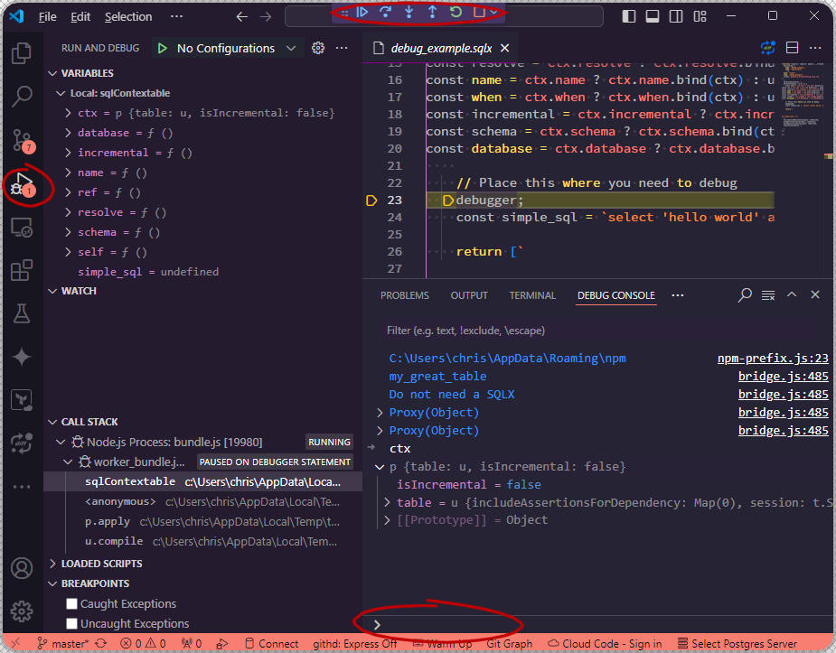

# Dataform examples

## Debugging Dataform JavaScript

As an engineer who is not familiar with the Node.js ecosystem, debugging JavaScript in Dataform might make you feel lost.
I will try to explain how I debug JavaScript and maybe you will find this helpful.

### Run and Debug in VSCode

Let's start by clicking on the debugging tab in VScode and opening a JavaScirpt Debug Terminal.


When you click on this you will get a second terminal. This will be below any other terminals you may already have open.

Now, we can add `debugger;` statements within our JavaScript code for breakpoints.


In Dataform, we need to then run a compile within the Debug Terminal. We also need to pass the timeout option to a high time (otherwise it will error out before we drop into debug mode).

```ps1
dataform compile --timeout 10m
```



Now we can inspect the state of variables, step through lines of code and use the Debug Console to test lines of JavaScript code.

Try cloning this example repo and testing it out for yourself. I have left the `debugger;` statement in this SQLX file.

[./definitions/debug_example.sqlx](./definitions/debug_example.sqlx)

## External clients

This example shows the basics of how to define constant variables within the includes directory and how to reference them.

We can reference them both within a SQLX or directly in a JavaScript file.

```ps1
dataform compile
Compiling...

Do not need a SQLX
{ name: 'test-01' }
{ name: 'test-02' }
Within a SQLX
{ name: 'test-01' }
{ name: 'test-02' }
Compiled 1 action(s).
1 operation(s):
  dataform.external
```
